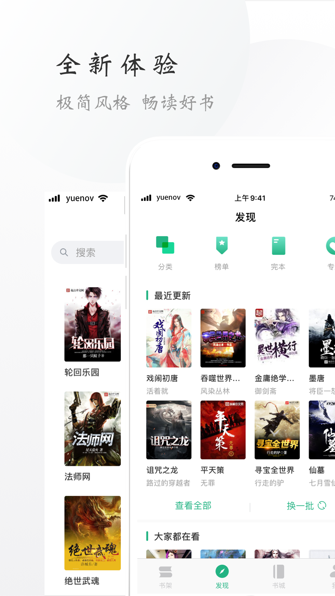
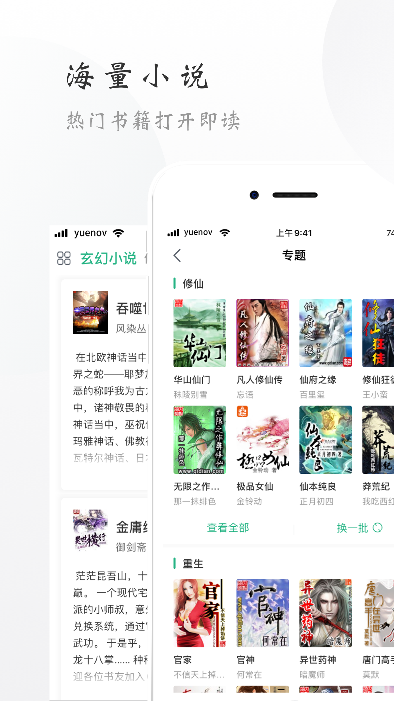
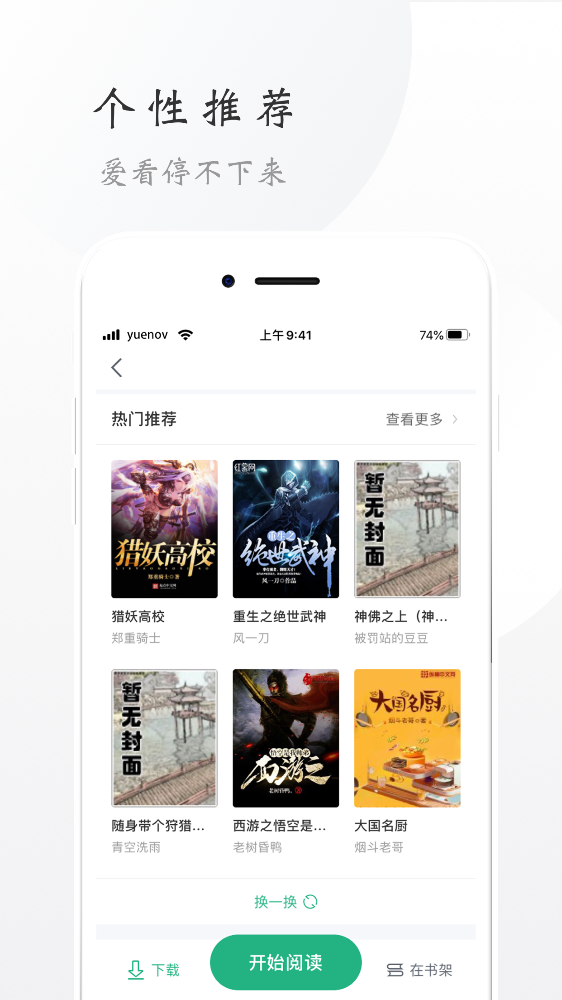
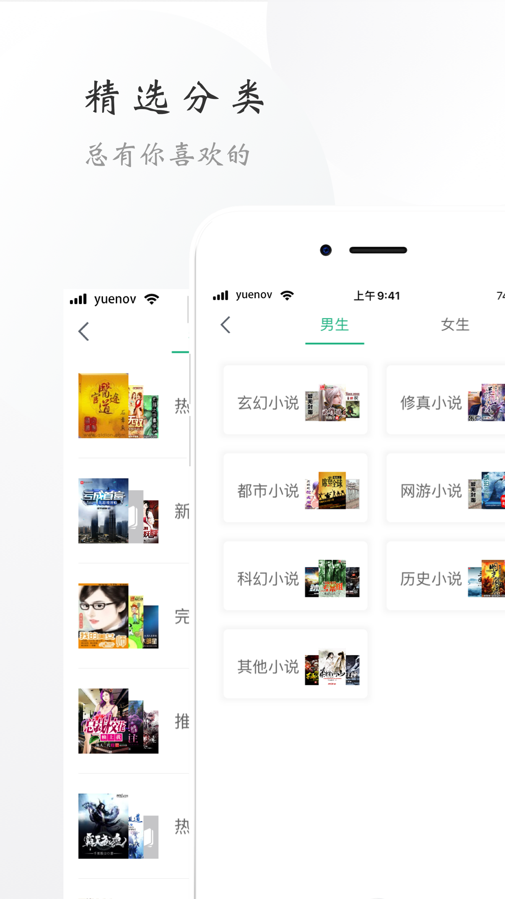
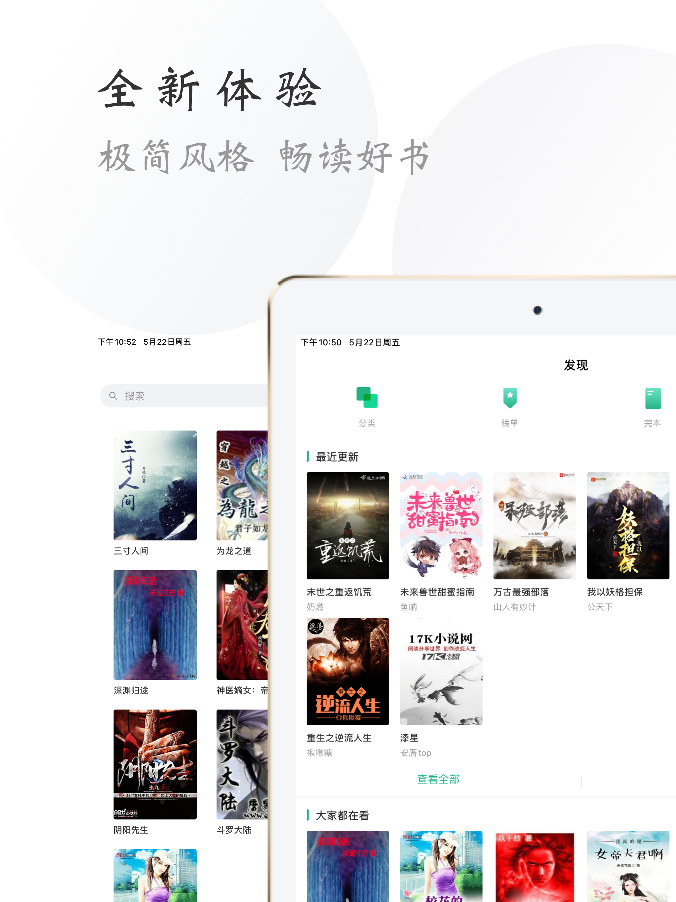
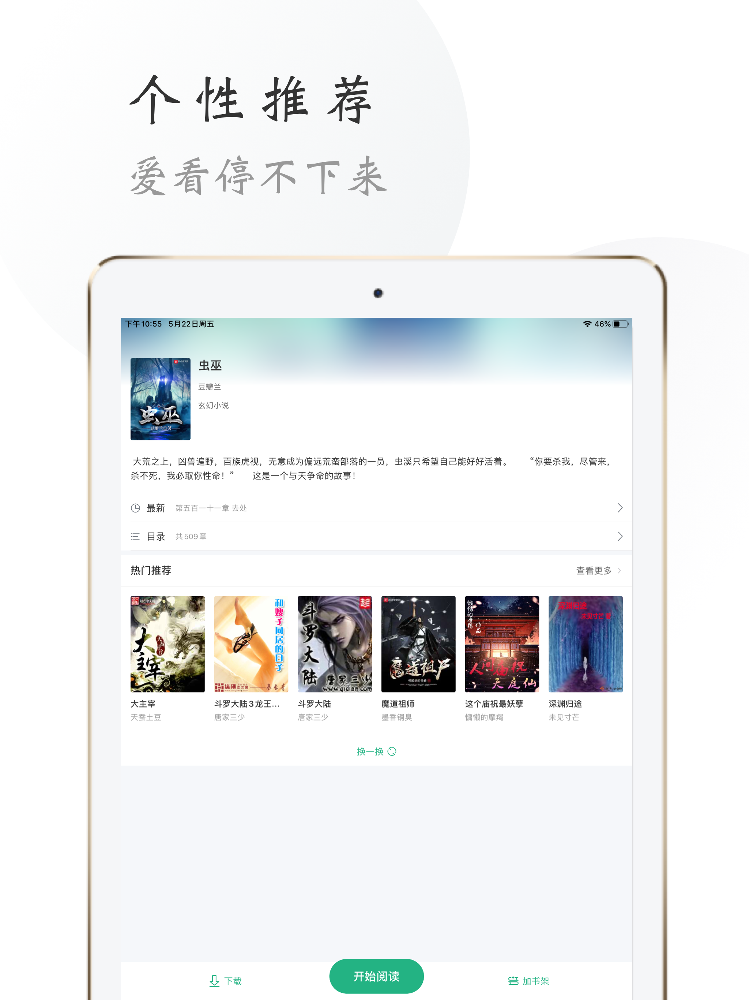

# 阅小说iOS客户端

iOS客户端使用的是阅小说开源免费的API：

[阅小说接口文档](https://github.com/yuenov/reader-api)

阅小说App已经上线[App Store](https://apps.apple.com/cn/app/id1505061125)和[Google Play](https://play.google.com/store/apps/details?id=com.books.yuenov)，也可以通过下面的链接下载：

**阅小说下载地址**

**[http://yuenov.com](http://yuenov.com?ch=g)**

 


**欢迎对我们产品提出任何的意见与反馈**

*Telegram*: [https://t.me/yuenov](https://t.me/yuenov)

*Gmail*: <yuenov@gmail.com>

相关链接：

[阅小说Android客户端](https://github.com/yuenov/reader-android)

[阅小说接口文档](https://github.com/yuenov/reader-api)

 ---

 ## 部分界面预览

- **iPhone/iPod**



- **iPad**



## 使用

下载项目到本地，终端执行

```
pod install
```

一般会出现如下报错：

```
fatal: unable to access 'https://chromium.googlesource.com/webm/libwebp/': Failed to connect to chromium.googlesource.com port 443: Operation timed out
```

这是由于项目中使用了Google开源的**libwebp**库对WebP图片进行解析，如果终端没有设置代理，那么这个库就无法下载，但是可以使用该库的镜像文件。具体操作如下：

1. 在cocoapods的仓库找到libwebp的路径，默认路径如下

    ```
    ~/.cocoapods/repos/{cocoapods主仓库名称}/Specs/1/9/2/libwebp
    ```

2. 找到对应的库版本，这里使用的是1.1.0，打开该文件夹下面的`libwebp.podspec.json`文件

3. 替换`libwebp.podspec.json`文件`source`中的git地址由`https://chromium.googlesource.com/webm/libwebp`替换为`https://github.com/webmproject/libwebp.git`

    ``` json
    "source": {
        "git": "https://github.com/webmproject/libwebp.git",
        "tag": "v1.1.0"
    }
    ```

4. 重新运行`pod install`

## 声明

**服务器只提供搜索以及在线转码的计算能力，没有存储任何小说内容。如有任何疑问请通过上面提供的联系方式联系我们。**